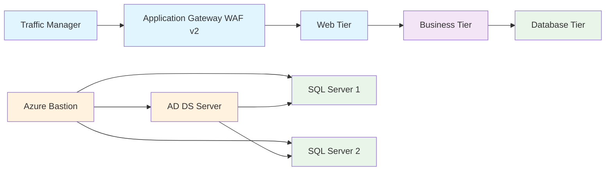

## Azure 3-Tier Architecture (Schematic)

### Mermaid Diagram (Simplified)


### Text-Based Architecture Diagram
```
┌─────────────────────────────────────────────────────────────────────────────┐
│                           AZURE 3-TIER ARCHITECTURE                        │
└─────────────────────────────────────────────────────────────────────────────┘

Internet
    │
    ▼
┌─────────────────┐
│ Traffic Manager │ (azure-3tier-tm-ypggv.trafficmanager.net)
└─────────────────┘
    │
    ▼
┌─────────────────────────────────┐
│ Application Gateway WAF v2      │ (172.172.140.190)
│ - Standard v2 SKU               │
│ - HTTP/HTTPS routing            │
└─────────────────────────────────┘
    │
    ▼
┌─────────────────────────────────┐
│ WEB TIER                        │
│ Subnet: 10.0.1.0/24            │
│ - Web VM Scale Set (Ubuntu)     │
│ - NGINX web servers             │
│ - NSG: 80/443 from App Gateway  │
└─────────────────────────────────┘
    │
    ▼
┌─────────────────────────────────┐
│ BUSINESS TIER                   │
│ Subnet: 10.0.2.0/24            │
│ - Business VM Scale Set         │
│ - Application logic             │
│ - NSG: 80/443 from Web tier     │
└─────────────────────────────────┘
    │
    ▼
┌─────────────────────────────────┐
│ DATABASE TIER                   │
│ Subnet: 10.0.3.0/24            │
│ - SQL Server 1 (az3t-sql-0)    │
│ - SQL Server 2 (az3t-sql-1)    │
│ - NSG: 1433 from Business tier  │
└─────────────────────────────────┘

┌─────────────────────────────────┐
│ MANAGEMENT TIER                 │
│ Subnet: 10.0.4.0/24            │
│ - Azure Bastion (172.190.151.38)│
│ - AD DS Server (azure-3tier-ad) │
│ - Domain: Centramax.com.uk      │
│ - NSG: RDP from admin IP        │
└─────────────────────────────────┘
```

### Static Diagram Images
- **PNG Format**: [diagrams/architecture.png](diagrams/architecture.png)
- **SVG Format**: [diagrams/architecture.svg](diagrams/architecture.svg)

Notes:
- NSGs: Web (80/443), Management (22/3389), Biz (intra-VNet), DB (1433 from Biz only).
- SQL VMs join the AD domain and sit behind the DB internal load balancer.
- Traffic flows: TM -> Web LB -> Web VMSS -> Biz LB -> Biz VMSS -> DB LB -> SQL VMs.

