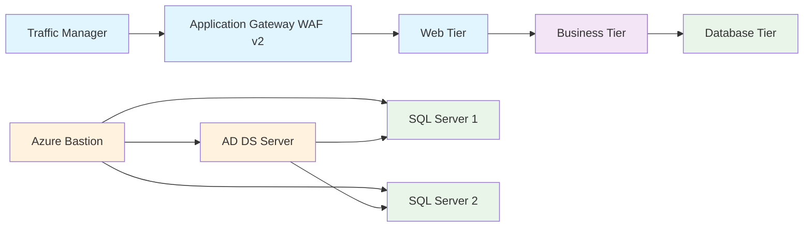

# Azure 3-Tier Infrastructure - Resource Inventory

## Overview
This document provides a comprehensive list of all Azure resources created by the Terraform deployment.

**Resource Group**: `azure-3tier-rg-ypggv`  
**Location**: East US (except Traffic Manager - Global)  
**Total Resources**: 43  
**Deployment Date**: $(date)

## Infrastructure Architecture Diagram

### Mermaid Diagram (Simplified)


### Text-Based Architecture Diagram
```
┌─────────────────────────────────────────────────────────────────────────────┐
│                           AZURE 3-TIER ARCHITECTURE                        │
└─────────────────────────────────────────────────────────────────────────────┘

Internet
    │
    ▼
┌─────────────────┐
│ Traffic Manager │ (azure-3tier-tm-ypggv.trafficmanager.net)
└─────────────────┘
    │
    ▼
┌─────────────────────────────────┐
│ Application Gateway WAF v2      │ (172.172.140.190)
│ - Standard v2 SKU               │
│ - HTTP/HTTPS routing            │
└─────────────────────────────────┘
    │
    ▼
┌─────────────────────────────────┐
│ WEB TIER                        │
│ Subnet: 10.0.1.0/24            │
│ - Web VM Scale Set (Ubuntu)     │
│ - NGINX web servers             │
│ - NSG: 80/443 from App Gateway  │
└─────────────────────────────────┘
    │
    ▼
┌─────────────────────────────────┐
│ BUSINESS TIER                   │
│ Subnet: 10.0.2.0/24            │
│ - Business VM Scale Set         │
│ - Application logic             │
│ - NSG: 80/443 from Web tier     │
└─────────────────────────────────┘
    │
    ▼
┌─────────────────────────────────┐
│ DATABASE TIER                   │
│ Subnet: 10.0.3.0/24            │
│ - SQL Server 1 (az3t-sql-0)    │
│ - SQL Server 2 (az3t-sql-1)    │
│ - NSG: 1433 from Business tier  │
└─────────────────────────────────┘

┌─────────────────────────────────┐
│ MANAGEMENT TIER                 │
│ Subnet: 10.0.4.0/24            │
│ - Azure Bastion (172.190.151.38)│
│ - AD DS Server (azure-3tier-ad) │
│ - Domain: Centramax.com.uk      │
│ - NSG: RDP from admin IP        │
└─────────────────────────────────┘
```

### Static Diagram Images
- **PNG Format**: [diagrams/architecture.png](diagrams/architecture.png)
- **SVG Format**: [diagrams/architecture.svg](diagrams/architecture.svg)
- **Source File**: [diagrams/architecture.mmd](diagrams/architecture.mmd)

### Architecture Notes
- **NSGs**: Web (80/443), Management (22/3389), Biz (intra-VNet), DB (1433 from Biz only)
- **SQL VMs**: Join the AD domain and sit behind the DB internal load balancer
- **Traffic Flow**: TM → Web LB → Web VMSS → Biz LB → Biz VMSS → DB LB → SQL VMs
- **Security**: Azure Bastion replaces Jumpbox, Application Gateway WAF v2 replaces public Web LB

## Resource Inventory Table

| Resource Type | Resource Name | Location | Purpose | Key Details |
|---------------|---------------|----------|---------|-------------|
| **Resource Group** | azure-3tier-rg-ypggv | East US | Container for all resources | Main resource group |
| **Virtual Network** | azure-3tier-vnet | East US | Network foundation | CIDR: 10.0.0.0/16 |
| **Subnet** | subnet_web | East US | Web tier network | CIDR: 10.0.1.0/24 |
| **Subnet** | subnet_biz | East US | Business tier network | CIDR: 10.0.2.0/24 |
| **Subnet** | subnet_db | East US | Database tier network | CIDR: 10.0.3.0/24 |
| **Subnet** | subnet_mgmt | East US | Management tier network | CIDR: 10.0.4.0/24 |
| **Subnet** | subnet_appgw | East US | Application Gateway network | CIDR: 10.0.20.0/24 |
| **Subnet** | subnet_bastion | East US | Azure Bastion network | CIDR: 10.0.21.0/24 |
| **NSG** | azure-3tier-nsg-web | East US | Web tier security | Allows 80/443 from App Gateway |
| **NSG** | azure-3tier-nsg-biz | East US | Business tier security | Allows 80/443 from Web tier |
| **NSG** | azure-3tier-nsg-db | East US | Database tier security | Allows 1433 from Business tier |
| **NSG** | azure-3tier-nsg-mgmt | East US | Management tier security | Allows RDP from admin IP |
| **Public IP** | azure-3tier-appgw-pip | East US | Application Gateway IP | IP: 172.172.140.190 |
| **Public IP** | azure-3tier-bastion-pip | East US | Azure Bastion IP | IP: 172.190.151.38 |
| **Load Balancer** | azure-3tier-biz-lb | East US | Business tier LB | Internal load balancer |
| **Load Balancer** | azure-3tier-db-lb | East US | Database tier LB | Internal load balancer |
| **Application Gateway** | azure-3tier-appgw | East US | Web traffic routing | Standard v2 with WAF |
| **Azure Bastion** | azure-3tier-bastion | East US | Secure management access | RDP/SSH over TLS |
| **Traffic Manager** | azure-3tier-tm-ypggv | Global | Global load balancing | FQDN: azure-3tier-tm-ypggv.trafficmanager.net |
| **Virtual Machine** | azure-3tier-ad | East US | Active Directory DS | Windows Server 2022 |
| **Virtual Machine** | az3t-sql-0 | East US | SQL Server 1 | Windows Server 2022 + SQL 2019 |
| **Virtual Machine** | az3t-sql-1 | East US | SQL Server 2 | Windows Server 2022 + SQL 2019 |
| **Network Interface** | azure-3tier-ad-nic | East US | AD VM network | Connected to mgmt subnet |
| **Network Interface** | azure-3tier-sqlnic-0 | East US | SQL VM 1 network | Connected to db subnet |
| **Network Interface** | azure-3tier-sqlnic-1 | East US | SQL VM 2 network | Connected to db subnet |
| **VM Extension** | azure-3tier-ad/ad-ds | East US | AD DS promotion | Domain: Centramax.com.uk |
| **VM Extension** | az3t-sql-0/sql-dns-join-0 | East US | SQL VM 1 domain join | Auto-join domain |
| **VM Extension** | az3t-sql-1/sql-dns-join-1 | East US | SQL VM 2 domain join | Auto-join domain |
| **OS Disk** | azure-3tier-ad_OsDisk_1_cc17f096f8434e8abfcaa803c0a9d0d3 | East US | AD VM disk | Standard SSD |
| **OS Disk** | az3t-sql-0_OsDisk_1_135d81f059d743659aaf3df6f84b26dd | East US | SQL VM 1 disk | Standard SSD |
| **OS Disk** | az3t-sql-1_OsDisk_1_8899280172004bcab8217175fafbb7b9 | East US | SQL VM 2 disk | Standard SSD |
| **Marketplace Agreement** | sql2019_ws2022_standard | East US | SQL Server licensing | SQL Server 2019 Standard |
| **LB Backend Pool** | azure-3tier-biz-lb backend pool | East US | Business tier backend | Targets business VMs |
| **LB Backend Pool** | azure-3tier-db-lb backend pool | East US | Database tier backend | Targets SQL VMs |
| **LB Health Probe** | azure-3tier-biz-lb probe | East US | Business tier health check | HTTP probe on port 80 |
| **LB Health Probe** | azure-3tier-db-lb probe | East US | Database tier health check | TCP probe on port 1433 |
| **LB Rule** | azure-3tier-biz-lb rule | East US | Business tier routing | Port 80 → backend pool |
| **LB Rule** | azure-3tier-db-lb rule | East US | Database tier routing | Port 1433 → backend pool |
| **Subnet-NSG Association** | web-subnet-nsg | East US | Web security binding | Web subnet → Web NSG |
| **Subnet-NSG Association** | biz-subnet-nsg | East US | Business security binding | Business subnet → Business NSG |
| **Subnet-NSG Association** | db-subnet-nsg | East US | Database security binding | Database subnet → Database NSG |
| **Subnet-NSG Association** | mgmt-subnet-nsg | East US | Management security binding | Management subnet → Management NSG |
| **Backend Pool Association** | sql-0-bepool | East US | SQL VM 1 → DB LB | NIC → backend pool |
| **Backend Pool Association** | sql-1-bepool | East US | SQL VM 2 → DB LB | NIC → backend pool |
| **Traffic Manager Endpoint** | tm-web-endpoint | Global | Web traffic routing | Points to App Gateway |

## Key Access Information

| Service | Access Method | URL/IP | Port | Protocol |
|---------|---------------|--------|------|----------|
| **Web Application** | Traffic Manager | azure-3tier-tm-ypggv.trafficmanager.net | 80 | HTTP |
| **Application Gateway** | Direct | 172.172.140.190 | 80 | HTTP |
| **Azure Bastion** | Azure Portal | 172.190.151.38 | 443 | HTTPS |
| **Active Directory** | RDP via Bastion | azure-3tier-ad | 3389 | RDP |
| **SQL Server 1** | RDP via Bastion | az3t-sql-0 | 1433 | TCP |
| **SQL Server 2** | RDP via Bastion | az3t-sql-1 | 1433 | TCP |

## Security Configuration

| Tier | NSG Rules | Access Control |
|------|-----------|----------------|
| **Web** | Port 80/443 from App Gateway subnet only | Restricted to Application Gateway |
| **Business** | Port 80/443 from Web subnet | Internal communication only |
| **Database** | Port 1433 from Business subnet | SQL Server access only |
| **Management** | RDP from admin source IP | Administrative access |

## Domain Configuration

- **Domain Name**: Centramax.com.uk
- **DSRM Password**: BirdGrainSeed123!
- **Domain Controller**: azure-3tier-ad
- **Domain Members**: az3t-sql-0, az3t-sql-1

## Cost Optimization Features

- **VM Sizes**: Standard_B2s for SQL VMs (cost-effective)
- **Storage**: Standard SSD for OS disks
- **Load Balancers**: Standard SKU for internal tiers
- **Application Gateway**: Standard v2 (pay-per-use)

---

*This inventory was generated automatically from the Terraform state file.*
